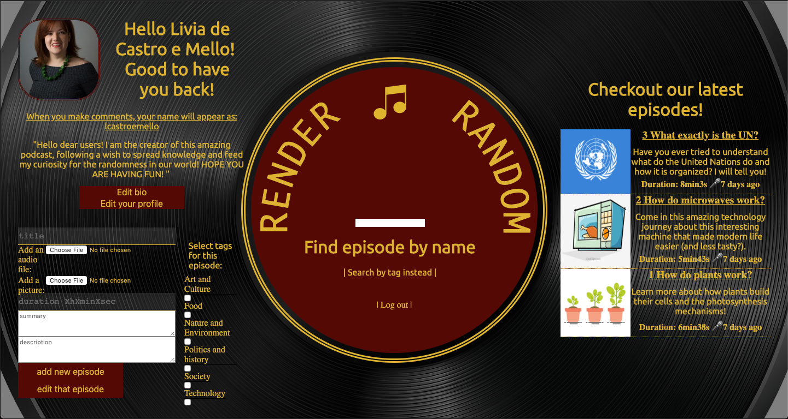

# RENDER RANDOM - THE PODCAST

## Description

Web page designed to host my personal podcast about random curiosities of daily life. (Project developed  in 7 days as final graduation project in SPICED Academy / Berlin )

## Developed with: 

- AWS S3 -  storaging audio and picture files
- SQL / Postgres - database management
- Socket-IO - instantaneous update on comment boards
- Express / Node-js - coordination of server functions
- ReactJs - Modular page development in components. Includes:
  - Hooks API 
  - Redux
- CSS - styling and animations

## Features:

Users must be logged in to listen to the podcast. On the welcome page they can register for the first time or log into their accounts

On the login/registration process, users receive tailor-made error messages in case something goes wrong

After they are logged, they are welcomed on their user page, where they can update their user picture, bio and profile information

From their user page, they can directly choose among the last three published episodes of the podcast or search for a particular episode, by name or by theme-tag

After clicking on the desired episode, they are welcomed on the page for that episode. On that page they will find 

- The episode title, picture, duration and description
- Audio player for listening to the podcast (with the bonus feature of a background that spins when you are listening to the episode and stops when you pause)

After listening to that episode, the user can choose to comment and his message is instantaneously updated onto the comment section

Users might also add that episode in their favorites list, being able to access it from their user page in the future, as well as remove it from their favorites from both the episode page and their user page

As the administrator of the podcast, when I access my personal page instead of a list of favorites, I have the chance of adding an episode to the list that will appear to my users

## Features to be added:

- Live chat with podcaster every friday for logged in users
- Editing and Deleting episodes directly on episode (Admin only)
- Share this episode with friends in social medias
- Allow users to listen to episodes without having to log in
- Improve player experience with player API
- Include episode transcriptions to facilitate search 
- About page (history of the podcast)
- Related links on each episode to enrich user's knowledge on that subject
- Contact page